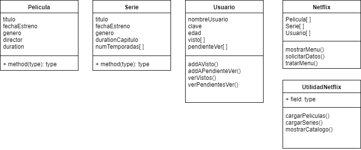
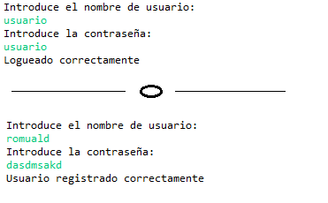
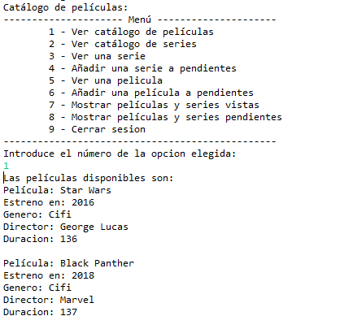

# Gestor de aplicación de stream de series

:clapper: Aplicación de gestión de un **sistema de stream de series y películas** programado en Python para la asignatura de 'Sistemas de gestión empresarial'. Nuestra aplicación consiste en un sistema que ofrece al usuario registrado logearse y ver las películas o series disponibles, *mientras esté al corriente de pago* :money_with_wings:. El sistema trackeará que películas y series ha visto.

## Guía para colaborar
 

     
¿Qué es git?

 

Git es un **sistema de control de versiones** (vcs) que permite la colaboración entre programadores de forma simultánea solucionando y facilitando muchísimo la *integración* del código fuente de los contribuidores. Su funcionamiento consiste en la creación de versiones del proyecto llamados *commits*. Los proyectos pueden seguir diferentes *ramas* según la funcionalidad que se esté implementando o el contribuidor que la esté actualizando. Las diferentes ramas pueden fusionarse a otras ramas, o la rama principal *'master'* e integrar las funcionalidades de ambas ramas en una nueva línea troncal. Abajo podéis ver una ilustración de un arbol versiones de Git.

    

  </li>
      

 

 

     
Pasos básicos

 

#### Descargarte el proyecto de nuevo
  1. :arrow_down: Abre una terminal en el directorio del workspace e introduce: `git clone https://github.com/ismenc/python-gestor-series`

#### Actualizar si ya lo tienes descargado
  1. :open_file_folder: Abre una terminal en el directorio del proyecto
  2. :heavy_check_mark: Colócate en tu rama mediante `git checkout -b tu-nombre`
  3. :recycle: Descárgate tu última versión con `git pull origin tu-nombre`

#### Subir tus versiones después de trabajar
  1. :memo: Trabaja con eclipse o como lo quieras hacer
  2. :open_file_folder: Abre una terminal en el directorio del proyecto
  3. :heavy_check_mark: Si no lo has hecho, colócate en tu rama mediante `git checkout -b tu-nombre`
  4.  :exclamation: Haz tu nueva version con `git commit -am "Resumen de cambios"`
  5. :arrow_up: Sube tus versiones con `git push origin tu-nombre`
  </li>
      

	   

## Índice de contenidos
 

* Índice
    * [1. Integrantes](#1-integrantes)
    * [2. Estructura del proyecto](#2-estructura-del-proyecto)
    * [3. Funcionamiento de la aplicación](#3-funcionamiento-de-la-aplicación)
    * [4. Manual del proyecto](#4-manual-del-proyecto)
    * [5. Fallos conocidos y mejoras propuestas](#5-fallos-conocidos-y-mejoras-propuestas)
    * [6. Historial de versiones](#6-historial-de-versiones)
    * [7. Problemas y soluciones](#7-problemas-y-soluciones)
    * [Agradecimientos](#agradecimientos)

## 1. Integrantes

Los participantes en el proyecto son:
* Ismael Núñez Carrión
* Diego Arroyo García
* Davinia Pineda Bonilla
* Eduardo Muñoz Villalba
* Ricardo Terán

## 2. Estructura del proyecto

El proyecto se ha estructurado en varias carpetas.

:open_file_folder: [src](src/) - carpeta raíz del código fuente. Donde se encuentran las carpetas `modelo`, `datos` y clases principal y Util.

:open_file_folder: [modelo](src/modelo/) - carpeta donde se encuentran los modelos de los objetos `Usuario`, `Serie` y `Pelicula`.

:open_file_folder: [datos](src/datos/) - carpeta donde se encuentran los ficheros de persistencia de datos.

### Diagrama de clases

### Estructura de clases
 

     
Película

 

	 
Clase que define la estructura de los objetos película.
 

#### Atributos

* ***titulo:*** *título de la película*
* ***fechaEstreno:*** *fecha de estreno de la película*
* ***genero:*** *género(drama, comedia, etc.)*
* ***director:*** *director de la película*
* ***duracion:*** *duración de la película*

 

 
  

     
Serie

 

	 
Clase que define la estructura de datos del objeto serie.
 

#### Atributos

* ***titulo:*** *título de la serie*
* ***fechaEstreno:*** *fecha de estreno de la serie*
* ***genero:*** *género(thriller, aventura, etc.)*
* ***duracionCapitulo:*** *duración media*
* ***temporadas:*** *temporadas de la serie, array de tipo String*
* ***numTemporadas:*** *numero de temporadas actuales de la serie*

 

 
  

 

     
Usuario

 

Clase que almacena los datos del usuario.

#### Atributos

* ***nombreUsuario:*** *nombre del usuario*
* ***clave:*** *clave del usuario*
* ***edad:*** *edad del usuario*
* ***visto:*** *marcar como visto (array)*
* ***pendienteVer:*** *marcar como pendiente de ver (array)*

#### Métodos

* ***addVisto():*** *agregar si ha visto la película o serie*
* ***addPendienteVer():*** *agregar si tiene una película o serie pendiente*
* ***verVistos():*** *ver listrado de reproducciones*
* ***verPendientesVer():*** *ver listado de películas o series pendientes de ver*

 

 
 

 

     
_init_

 

Programa principal que contiene la línea de ejecución de nuestro programa

#### Métodos

* ***cargarPeliculas():*** *muestra las películas disponibles*
* ***cargarSeries():*** *muestra las series disponibles*
* ***mostrarCatalogo():*** *muestra el catálogo completo de series y películas*

 

 
 

 

     
Util

 

Clase que provee a la principal de los métodos estáticos para interactuar con el usuario y gestionar los objetos.

#### Atributos

* ***pelicula:*** *lista de películas (array)*
* ***serie:*** *lista de series (array)*
* ***usuario:*** *usuario el cuál accede a la aplicación*

#### Métodos

* ***mostrarMenu():*** *método que mostrará un menú con las opciones disponibles*
* ***tratarMenu():*** *método que tratará la opción elegida del menú*
* ***solicitarDatos():*** *método para la gestión del usuario que se quiera registrar*

 

 

 ## 3. Funcionamiento de la aplicación

 Nada más iniciar la aplicación, solicitará los datos de usuario y si no existe lo creará y guardará en la base de datos (usuarios.txt), como se muestra en la imagen:

 

 Tras comprobar el pago, aparecerá un menú que le permitirá al usuario operar con el sistema.

 

 Por brevedad no mostraremos las imágenes de todas las opciones.

 **¿Por qué no lo pruebas por tí mismo?**

 > Dirígete a [releases](https://github.com/ismenc/python-gestor-series/releases)

 ## 4. Manual del proyecto

 Puedes ver el manual en el documento:
 > :book: [Manual_proyecto.pdf](doc/manual_proyecto.pdf)

 ## 5. Fallos conocidos y mejoras propuestas

 ### Fallos conocidos :exclamation:

 * Los datos de vistas/pendientes de usuario no persisten.
 * No se pueden marcar como vistas temporadas o capítulos aislados de series.
 * No existe opción aparte para registro de usuario.
 * El sistema de pagos no fucniona :joy:

 ### Aciertos :heavy_check_mark:

 * Entradas por teclado validadas
 * Peliculas y series agregadas a visto/pendientes validadas
 * Experiencia de usuario
 * Modularización, legibilidad y mantenibilidad
 * Documentación
 * Organización

 ### Mejoras propuestas :wrench:

 * Guardar en base de datos pelis y series vistas/pendientes
 * Mejorar el sistema de guardado de series vistas para poder contabilizar los capítulos vistos
 * Más participación de parte de los integrantes del proyecto :boom:
 * Interfaz gráfica
 
 ## 6. Historial de versiones
 
 Para ver el mapa de versiones entra en:
 > [:scroll: Network](https://github.com/ismenc/python-gestor-series/network)

 
 ## 7. Problemas y soluciones
 
  :question: Algunos participantes han usado Python 3 y otros Python 2. Lee a continuación cómo solucionar posibles problemas.
 
 :red_circle: Python 3 puede marcar errores en librerías que son necesarias para Python 2 y viceversa.
 :heavy_check_mark: Comenta y descomenta mediante `#` las líneas de los imports erróneos.
 
 :red_circle: En Python 3, se han unido las funciones `input` y `raw_input`. 
 :heavy_check_mark: Si surgen errores cambia `input` por `raw_input` en `Util.py` -> `solicitarCadena()` y `leerEntero()`. 

## Agradecimientos

Agradecimientos a *Manolo* Por ser comprensivo y flexible con la entrega del proyecto, ayudarnos y leer este documento :joy:. 

 